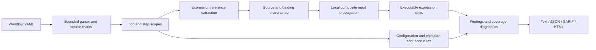

# Analysis model

The engine reads local workflow YAML into strings, lists, and mappings with source marks. It never constructs Python objects from YAML or evaluates workflow code.

## Expression and scope model

`expressions.py` tokenizes expression references while skipping quoted string literals. Dot access and literal single-quoted bracket access normalize to one reference string. A source classifier marks selected free-text GitHub event fields as untrusted. Declared string-like dispatch/call inputs are seeded as caller-controlled; typed boolean and number inputs are excluded.

`Context` resolves references through scope definitions recursively, attaches provenance at each binding, and stops cycles. Workflow, job, and step environment maps compose with the most local definition winning. Matrix alternatives merge conservatively rather than creating separate executions. This is a may-flow analysis: possible provenance is preserved, not a runtime value evaluator. Environment self-reference and binding-time semantics are not fully represented.

Local composites receive caller-resolved input flows and inherited environment definitions. Calls are resolved from the repository root, restricted to that root, and bounded by recursion/depth checks. Call-site identity contributes to finding fingerprints so separate calls can be distinguished. Reusable workflows are reported as unexpanded coverage, not silently treated as analyzed.

## Checkout sequence model

AT002 retains PR-related checkout evidence inside a step list. A later recognized execution command or local action produces a review finding. The state is intentionally retained across subsequent checkout steps because separate checkout paths may coexist. The analyzer cannot prove which checkout a command reads and says so in its finding.

The checkout model is separate from expression taint: a PR head SHA is an immutable identifier and is not a shell-injection source, but it can select untrusted repository code. Conflating these two kinds of trust would produce misleading findings.

## Untrusted file handling

- UTF-8 YAML input capped at 1 MB per file.
- Bounded tree conversion: 30,000 expanded nodes and 80 levels.
- Duplicate keys, recursive aliases, merge keys, unsupported explicit tags are rejected.
- Paths escaping the repository, including resolved symlink targets, are rejected.
- HTML strings are escaped before rendering; report data is not embedded as executable JavaScript.
- Reports contain workflow metadata and source locations, not retrieved secrets or run logs. Workflow strings can themselves contain sensitive material, so review reports before sharing.

The tool assumes a stable local checkout while it scans. It does not claim protection against concurrent filesystem replacement, OS-level attacks, or every resource-exhaustion input in its YAML dependency. Running with an unprivileged account and ordinary resource limits remains appropriate for large untrusted repositories.

## Extending the engine

Each finding carries a rule ID, review priority, confidence, location, explanation, remediation, evidence nodes, and stable hash. Rules live in `analyzer.py`; serializers are independent in `render.py`.

Good next research milestones:

1. Sound output provenance with explicit unsupported-write diagnostics.
2. Reusable workflow call graphs and caller permission intersections.
3. Expression abstract values separating strings from booleans/validated identifiers.
4. Checkout path and working-directory tracking through composites.
5. A versioned, independently labeled real-workflow corpus measuring precision and recall.

These are future work, not implemented features.
